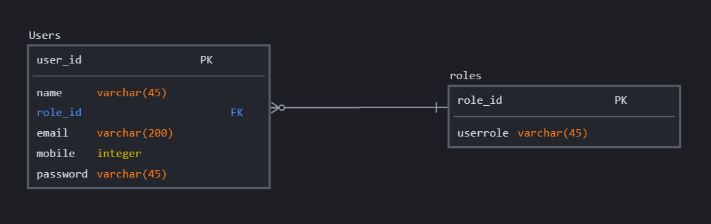

#  Marcus-website backend Site and RESTful API

The Admin site is used for backend management. The backend site focusces on the login and registering of users and management accounts. The management site can be found [here](https://marcus-login.herokuapp.com/)

## Context

The site management was built with [Express.js](https://expressjs.com/). along side the view engine [hbs](https://www.npmjs.com/package/hbs)

Please the account details to login as either Management or User.

Account Type | Email | Password
------------ | ------------- | -------------
Management | admintest@gmail.com | password
User | usertest@gmail.com | password

## Database document design

 

# Internal Routes

Route Type | Route Name | Purpose
------------ | ------------- | -------------
Get | /users/register | Client obtain infomation of register input fields
Post | /users/register | Service recieves infomation on user register
Get | /users/login | Client obtain infomation of login input fields
Post | /users/login | Service recieves infomation on user login
Get | /users/profile | Client obtain infomation on user
Get | /users/logout | Client token reset

# Technologies Used

- [Express.js](https://expressjs.com/)

  The Admin site and API uses Express .js, a fast, unopinionated, minimalist web framework for Node.js

- [Postgres](https://www.postgresql.org/)

  Heroku deployment natively uses postgres

- [MySql](https://www.mysql.com/)

  Used for testing within local environment

- [BookShelf ORM](https://bookshelfjs.org/)

  Used for backend. Object-Relational Mapping

- [db migrate](https://www.npmjs.com/package/db-migrate)

  Used for backend to create migration files 

- [Caolan forms](https://github.com/caolan/forms)

  Used for form validation

# Deployment

- [Heroku](https://dashboard.heroku.com/)

  This API is deployed using Heroku.

# Acknowledgements

Stackoverflow community for countless free tutorials and help on RESTful API development, validation and documentation.